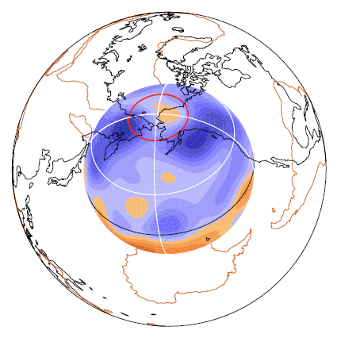
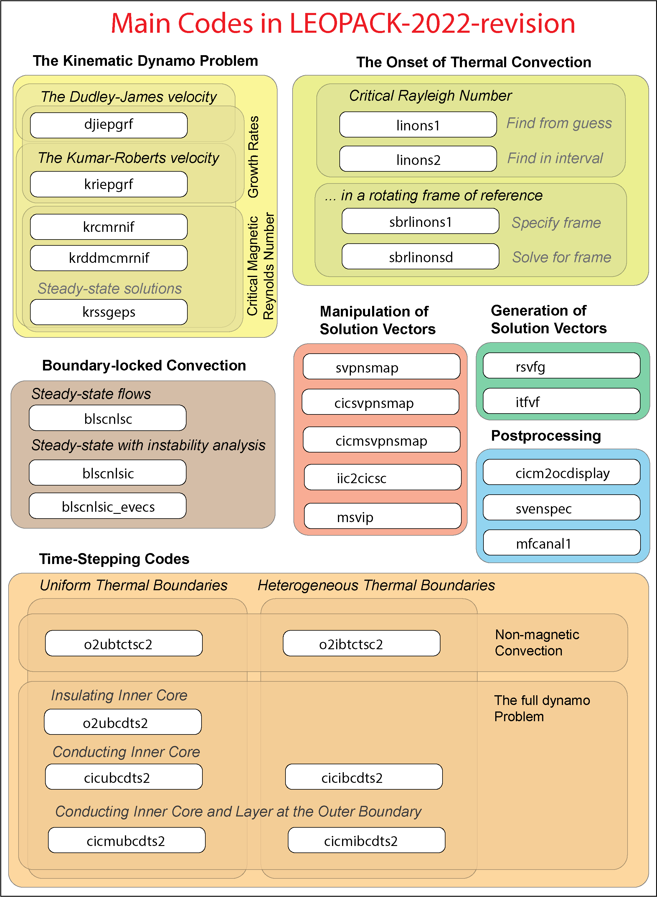
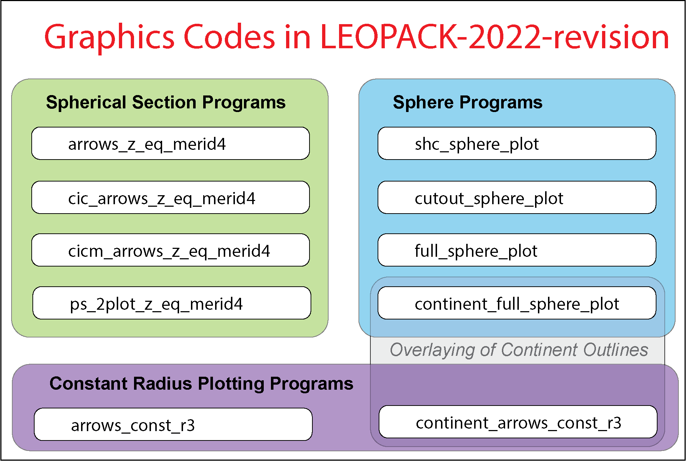

# LEOPACK-2022-revision
A set of FORTRAN77 codes for convection and magnetic field generation in rotating spherical geometry

Steven J. Gibbons (NGI) 2022-10-16

Release v1.0.1 (May 13, 2023) is permanently archived under Zenodo with DOI: 10.5281/zenodo.7932800 
 
https://doi.org/10.5281/zenodo.7932800

Between November 2001 and February 2002, I was working at the Institutt for geologi at the
University of Oslo, Norway, completing a postdoc position funded through the University of
Leeds in the UK. In this time, I collected and documented a set of codes for thermal convection and 
magnetic field generation in rotating spherical geometry that I had written and/or adapted to
solve diverse problems in Magnetohydrodynamics. Some of the codes had been started during
an earlier postdoc position at the University of Exeter. The product was a tar file containing
source code, input files, sample outputs, and a 600 page user guide.
The codes were subsequently adapted and modified by co-workers - David Gubbins, Chris Davies, Ashley Willis -
for subsequent research projects.

I named the software LEOPACK - Leeds, Exeter, Oslo - for want of a better name.

In this repository, I will add the codes - largely as they stood in February 2002 - first checking
that they work and making small modifications as necessary. On the one hand, there may be limited 
interest in the codes given that they are written in Fortran 77 and given that major
advances have been made in Magnetohydrodynamics research since February 2002.
On the other hand, the codes still work and compile with minimal or no modifications
(this can rarely be taken for granted after 20 years!) and there are many programs
for calculating solutions to fundamental problems for which I am not aware of any
alternative open codes.

The codes are largely self-contained. 
They use the LAPACK and BLAS linear algebra libraries.
The only additional requirements are from those codes which make 
graphical displays as these rely on the PGPLOT library:
https://sites.astro.caltech.edu/~tjp/pgplot/
As of today's date, I can obtain and compile the PGPLOT software from this source
and it still works (tested on Ubuntu 20 Linux). (In the original programs you could choose
gif, png, and postscript as output. I currently only get the postscript output to work.
I have not yet understood why the other formats are not working.)  

If one of the graphics programs generates a postscript file output.ps, you can generate
a pdf file (output.pdf) using  
psconvert output.ps -Tf -A  
and a png file (output.png) using  
psconvert output.ps -TG -A  
where psconvert is part of the GMT software (https://www.generic-mapping-tools.org/).  

To compile the graphics programs, make sure that the line
PGPLOT_LIB= [location of libpgplot.a]
in the file gprograms/Makefile
is set correctly prior to running the script
compile_graphics_programs.sh
and make sure that the environment variable PGPLOT_FONT is set to the location
of the file grfont.dat when you run any of the graphics programs.

I will add directories as and when I can test and document them.
I want each code to have its own pdf document, rather than the 600 page document
that came with the original package. I found this rather difficult to navigate
and, in the years that followed, I soon lost track of which programs were present.
This README file will be adapted with every directory I add.

The image below provides an at-a-glance overview of the main programs in LEOPACK.

The image below provides an at-a-glance overview of the graphics programs in LEOPACK.

Directories:
============

*linalg* (added 2022-10-18: contains all the BLAS, LAPACK, and ARPACK routines needed)

*subs* (added 2022-10-18: contains all the FORTRAN77 subroutines needed for the codes)

*gsubs* (added 2022-10-18: contains all the graphics subroutines that call PGPLOT routines)

*lib*, *bin* (added 2022-10-18: made to contain the libraries and graphics code binaries on compilation)

*gprograms* (source code for each of the GRAPHICS programs)

*programs* (source code for each of the non-graphics programs: these need to be compiled with the subroutine libraries and are not self-contained like the stand-alone codes in the directories LEOPACK_xxxx )

*WORKFLOWS* (added 2022-11-19: contains a growing number of examples of use of the programs)

*additional_documentation* (added 2022-11-19): contains a number of additional documents, partly distilled from my PhD Thesis.

(Programs for the linear onset of thermal convection)
=====================================================

**LEOPACK_linons1** (added 2022-10-16: Linear Onset of Thermal Convection 1)

**LEOPACK_linons2** (added 2022-10-16: Linear Onset of Thermal Convection 2)

**LEOPACK_sbrlinons1** (added 2022-10-24: Solid Body Rotation Linear Onset of Thermal Convection 1)

**LEOPACK_sbrlinonsd** (added 2022-10-24: Solid Body Rotation Linear Onset of Thermal Convection Drift Rate Solve)

(Programs for boundary locked convection)
=========================================

**LEOPACK_blscnlsc** (added 2022-10-16: Boundary Locked Steady Convection Non-Linear Solution Calculate)

**LEOPACK_blscnlsic** (added 2022-10-16: Boundary Locked Steady Convection Non-Linear Solution and Instability Calculate)

**LEOPACK_blscnlsic_evecs** (added 2022-10-17: Boundary Locked Steady Convection Non-Linear Solution and Instability Calculate with Eigenvectors)

(Programs for the Kinematic Dynamo Problem)
===========================================

**LEOPACK_djiepgrf** (added 2022-10-30: Dudley James velocity Instability Eigenvalue Problem Growth Rate Find)

**LEOPACK_kriepgrf** (added 2022-10-30: Kumar Roberts velocity Instability Eigenvalue Problem Growth Rate Find)

**LEOPACK_krcmrnif** (added 2022-10-30: Kumar Roberts velocity Critical Magnetic Reynolds Number Iterative Find)

**LEOPACK_krddmcmrnif** (added 2022-10-30: Kumar Roberts velocity Diamond DM parametrization Critical Magnetic Reynolds Number Iterative Find)

**LEOPACK_krssgeps** (added 2022-10-30: Kumar Roberts velocity Steady Solution Generalized Eigenvalue Problem Solve)

(Programs for full dynamo problem)
==================================

**LEOPACK_o2ubcdts2** (added 2022-10-23: Uniform Boundary Convective Dynamo Time Step Code 2)

**LEOPACK_cicibcdts2** (added 2022-10-17: Conducting Inner Core Inhomogeneous Boundary Convective Dynamo Time-Step code)

**LEOPACK_cicmubcdts2** (added 2022-10-18: Conducting Inner Core and Mantle Uniform Boundary Convective Dynamo Time-Step code)

**LEOPACK_cicubcdts2** (added 2022-10-22: Conducting Inner Core Uniform Boundary Convective Dynamo Time-Step code)

**LEOPACK_cicmibcdts2** (added 2022-10-18: Conducting Inner Core and Mantle Inhomogeneous Boundary Convective Dynamo Time-Step code)

(Programs for non-magnetic thermal convection)
==============================================

**LEOPACK_o2ibtctsc2** (added 2022-10-23: Inhomog. Boundary Thermal Conv. Time Step Code 2 )

**LEOPACK_o2ubtctsc2** (added 2022-10-23: Uniform Boundary Thermal Conv. Time Step Code 2 )

(Programs for manipulation of solution vectors)
===============================================

**LEOPACK_itfvf** (added 2022-10-23: Inhomogeneous Temperature Function Vector Form)

**LEOPACK_msvip** (added 2022-10-23: Multiple Solution Vector Ingestion Program)

**LEOPACK_rsvfg** (added 2022-10-23: Random Solution Vector File Generate)

**LEOPACK_iic2cicsc** (added 2022-10-22: Insulating Inner Core 2 Conducting Inner Core Solution Convert)

**LEOPACK_svenspec** (added 2022-10-24: Solution Vector Energy SPECtrum)

**LEOPACK_cicm2ocdisplay** (added 2022-10-18: Conducting Inner Core and Mantle 2 Outer Core Display)

**LEOPACK_svpnsmap** (added 2022-10-30: Solution Vector Perturbation and New Spatial Mesh Adaptation Program)

**LEOPACK_cicsvpnsmap** (added 2022-10-30: Conducting Inner Core Solution Vector Perturbation and New Spatial Mesh Adaptation Program)

**LEOPACK_cicmsvpnsmap** (added 2022-10-30: Conducting Inner Core and Mantle Solution Vector Perturbation and New Spatial Mesh Adaptation Program)

**LEOPACK_mfcanal1** (added 2022-10-30: Magnetic Field Component Analysis version 1)

(Programs for displaying solutions)
===================================

**GRAPHICS_arrows_const_r3** (added 2022-10-29: Constant radius plot with arrows)

**GRAPHICS_arrows_z_eq_merid4** (added 2022-10-29: Constant z or meridian plot with arrows)

**GRAPHICS_cic_arrows_z_eq_merid4** (added 2022-10-29: Conducting Inner Core Constant z or meridian plot with arrows)

**GRAPHICS_cicm_arrows_z_eq_merid4** (added 2022-10-29: Conducting Inner Core and Mantle Constant z or meridian plot with arrows)

**GRAPHICS_continent_arrows_const_r3** (added 2022-10-29: Constant radius plot with arrows with Continents)

**GRAPHICS_continent_full_sphere_plot** (added 2022-10-29: Full Sphere Plot with Continents)

**GRAPHICS_cutout_sphere_plot** (added 2022-10-29: Cut Out Sphere Plot)

**GRAPHICS_full_sphere_plot** (added 2022-10-29: Full Sphere Plot)

**GRAPHICS_ps_2plot_z_eq_merid2** (added 2022-10-29: Side-by-side Constant z or meridian plots)

**GRAPHICS_shc_sphere_plot** (added 2022-10-29: Spherical Harmonic Coefficient Sphere Plot)

WORKFLOWS
=========

A directory containing a set of procedures for addressing diverse problems with these codes.

workflow001_seismic_heatflux 
----------------------------

(added 2022/11/19) 

Generate a seismic-based heat-flux pattern for use as boundary conditions

workflow002_Benchmark_cases01_initial_conditions
------------------------------------------------

(added 2022/11/19) 

Provide starting conditions for the Case0 and Case1 benchmark convection and dynamo calculations in https://doi.org/10.1016/S0031-9201(01)00275-8

workflow003_GAFD_2007paper_examples
-----------------------------------

(added 2022/12/10)

Input files to generate the results in the paper https://doi.org/10.1080/03091920701472550

additional_documentation
========================

(added 2022/11/20)

Additional pdf (and tex) files describing the equations and the numerical representations which may be useful to the reader.

# Note on GNU Fortran compilers

(Steven J Gibbons 2023/03/02)

Please take a look at the following if codes will not compile.
This issue was discovered using gfortran v11.3.0 on Ubuntu 22

https://forum.mmm.ucar.edu/threads/how-to-fix-error-rank-mismatch-between-actual-argument-at-1-and-actual-argument-at-2.11998/#post-27521

This error affects only the external codes in the linalg directory and those stand-alone programs with eigenvalue problems.
If this issue occurs then add the term -fallow-argument-mismatch to the end of the line OPTIM= in the relevant Makefile

e.g.

change

OPTIM = -O3

to

OPTIM = -O3  -fallow-argument-mismatch

This will end up giving a warning but will allow the code to compile as before.

Makefiles in the affected directories have two lines:

OPTIM = -O3

OPTIM = -O3  -fallow-argument-mismatch

If you run the script

GNU_test.sh

it will tell you which of these two lines to comment out using #

The Makefiles affected are in the following directories:

* linalg

* LEOPACK_blscnlsic

* LEOPACK_blscnlsic_evecs

* LEOPACK_djiepgrf

* LEOPACK_krcmrnif

* LEOPACK_krddmcmrnif

* LEOPACK_kriepgrf

* LEOPACK_krssgeps

* LEOPACK_linons1

* LEOPACK_linons2

* LEOPACK_sbrlinons1

* LEOPACK_sbrlinonsd

**Running the script fix_Makefiles.sh should put the correct makefiles in all the correct directories**   

Questions regarding the use of the codes  
========================================  

It is my hope that these codes will be useful and I welcome any use of them. I am interested in hearing about any research performed with their use and I will respond to any questions regarding the programs' operation. The normal caveats will of course apply; I would ask you to send me the exact input files that you are using so that I can reproduce the problem.
  
